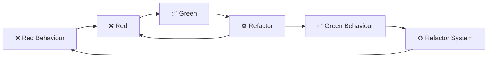

# Experiminets in Workshop

[
](https://github.com/failure-driven/experiments-in-workshops/actions/workflows/ci.yml)

Ideas on how to run a workshop, intially on testing.

## Scenario: AI powered guest book

```gherkin
Given a simple guest book app
When a new guest book entry is added
And the generate AI text option is selected
Then the user is informed that AI is processing the request
When the AI request is complete
Then a number of AI generated guest book entries are presented
When the user accepts an entry
And submits
Then the guest book entry is visible
```

### Setup

```sh
cd guestbook-rails-minimal
bin/setup
bin/rails server
open http://localhost:3000
```

```sh
make
just
just demo-ai

just clean
```

### Guestbook rails minimal

[
](https://github.com/failure-driven/experiments-in-workshops/actions/workflows/guestbook-rails-minimal-ci.yml)

```sh
cd guestbook-rails-minimal
just build
```

### Plain old coding dojo

1. choose a problem
    1. from a kata site
        1. http://codekata.com/
        1. https://github.com/gamontal/awesome-katas
        1. https://codingdojo.org/kata/
    1. formulate own problem
        1. **Given** some `state`
        1. **When** some `action` is performed
        1. **Then** some `result` can be asserted
1. create a folder or repo
   ```sh
   mkdir dojo
   git init
   # OR
   git clone git@github.com:failure-driven/dojo.git

    # AND
   mkdir `date +%F`-name-of-kata
   ```
1. setup ruby, rspec and a first test
   ```sh
   cd ... # directory created above

   # setup a ruby version
   asdf local ruby 3.3.0

   # initalize bundler for gem managment
   bundle init

   # add rspec gem
   bundle add rspec

   # initialize rspec
   bundle exec rspec --init

   # run rspec
   bundle exec rspec

   # create a dummy test and run it
   cat << EOF > spec/first_spec.rb
   RSpec.describe "first test" do
     it "runs" do
       expect(true).to be_truthy
     end
   end
   EOF

   # run it
   bundle exec rspec

   # switch to documentation format and run it
   echo "--format documentation" >> .rspec
   bundle exec rspec

   # create a lib directory for your implementation
   mkdir lib
   # create a class
   cat << EOF > lib/first.rb
   class First
   end
   EOF

   # make sure to require it in your spec
   # in spec/first_spec.rb
   require 'first'
   ```

1. TDD (Test Driven Development): red -> green -> refactor

   ```mermaid
   flowchart LR
       Red["❌ Red"] --> Green["✅ Green"]
       Green --> Refactor["♻ Refactor"]
       Refactor --> Red 
   ```

    1. Break the problem into first smallest chunk
    1. Write a failing test ❌ red
    1. Shamelessly implement as quickly as possible ✅ Green
    1. ♻ Refactor
        1. DRY - don't repeat yourself
        1. Both the code and the tests
        1. DAMP tests - Descriptive and Meaningful Phrases
        1. SOLID principles
            1. **S**ingle responsiblity
            1. **O**pen close
            1. **L**iskov substition
            1. **I**nterface segregation
            1. **D**ependency inversion
        1. others ...

1. Outside in BDD and TDD, BDD (Behaviour Driven Development):
   from the user perspective and TDD from the unit perspective



#### Extras

**co-authors**

```sh
# check your global config
vi ~/.gitconfig
git config --list
git config --global --edit

# install git-mob, it's a node module
npm install --global git-mob

# configure git-mob to grab users from the internt
git config --global git-mob-config.github-fetch true
# check your ~/.gitconfig
# add a user
git mob saramic
# check the template ~/.gitmessage
cat ~/.gitmessage
# show your users
git mob --list
# or
git cat ~/.git-coauthors

# show your mob
git mob
Jenny <jenny@example.com>
John  <john@example.com>

# go solo
git solo
# ie make the ~/.gitmessage have no co-authors
cat ~/.gitmessage
```

**watch specs**

```sh
bundle add guard-rspec
bundle exec guard init
guard
# now modify spec or code and tests will automatically re-run
```

**runnable command**

```sh
mkdir bin

cat << EOF > bin/run.rb
#!/usr/bin/env ruby

\$LOAD_PATH << File.join(File.dirname(__FILE__), '../lib')

# TODO: replace file name with class and filename
require 'file_name'

file_name = FileName.new
file_name.run(*ARGV)
EOF

# make script executable +x
chmod +x bin/run.rb

# run it
bin/run.rb arg_1 arg_2
```

**End-to-End test** runnable command

```sh
# create a feature spec directory and a feature spec that runs bin/run.rb
mkdir spec/features
cat << EOF > spec/features/feature_spec.rb
require "spec_helper"

feature "simple features" do
  let(:runner) { File.join(__dir__, "../../bin/run.rb") }

  scenario "runs successfully" do
    When "the runner is run" do
      @result = `bundle exec ruby #{runner} arg_1 arg_2`
    end

    Then "the result is as expected" do
      expect(@result).to eq(
        <<~EO_REPORT_OUTPUT
          ["arg_1", "arg_2"]
        EO_REPORT_OUTPUT
      )
    end
  end
end
EOF

# configure spec/spec_helper.rb to allow feature and scenario naming
RSpec.configure do |config|
  ...
  # add the Capybara like feature and scenario to make the spec/features read
  # more like BDD specs as per
  #   https://github.com/teamcapybara/capybara/blob/master/lib/capybara/rspec/features.rb
  RSpec.configure do |config|
    config.alias_example_group_to :feature, :capybara_feature, type: :feature
    config.alias_example_group_to :xfeature, :capybara_feature, type: :feature,
      skip: "Temporarily disabled with xfeature"
    config.alias_example_group_to :ffeature, :capybara_feature, :focus, type:
      :feature
    config.alias_example_to :scenario
    config.alias_example_to :xscenario, skip: "Temporarily disabled with xscenario"
    config.alias_example_to :fscenario, :focus
  end

# add rspec example steps Given/When/Then gem
bundle add rspec-example_steps
# configure spec/spec_helper.rb to allow Given/When/Then output
require "rspec/example_steps"
...
RSpec.configure do |config|
  ...
  # as per https://github.com/railsware/rspec-example_steps/issues/14
  RSpec::Core::Formatters.register(
    RSpec::Core::Formatters::DocumentationFormatter,
    :example_group_started,
    :example_group_finished,
    :example_passed,
    :example_pending,
    :example_failed,
    :example_started,
    :example_step_passed,
    :example_step_pending,
    :example_step_failed
  )
```

**Rubocop** for linting

```sh
bundle add standard rubocop-rspec rubocop-performance

cat << EOF > .rubocop.yml
# https://evilmartians.com/chronicles/rubocoping-with-legacy-bring-your-ruby-code-up-to-standard
require:
  - standard
  - rubocop-performance
  - rubocop-rspec

# Use the defaults from https://github.com/testdouble/standard
inherit_gem:
  standard: config/ruby-3.2.yml

AllCops:
  TargetRubyVersion: 3.3
  DefaultFormatter: progress
  DisplayCopNames: true
  DisplayStyleGuide: true
  NewCops: enable
  UseCache: true
  CacheRootDirectory: .
  MaxFilesInCache: 10000
  Exclude:
    - tmp/**/*
    - vendor/**/*

# any rubocop overrides live in here

RSpec/Capybara/FeatureMethods:
  EnabledMethods:
    - feature
    - scenario

RSpec/DescribedClass:
  EnforcedStyle: explicit

RSpec/ExampleLength:
  Max: 7
  CountAsOne:
    - array
    - hash
    - heredoc
    - method_call
  Exclude:
    - spec/features/**/*

RSpec/InstanceVariable:
  Exclude:
    - spec/features/**/*

RSpec/MultipleExpectations:
  Exclude:
    - spec/features/**/*

Style/BlockComments:
  Exclude:
    - spec/spec_helper.rb
EOF

# run rubocop
bundle exec rubocop

# autocorrect -a OR -A (potentially unsafe)
bundle exec rubocop -A
```

**makefile**

```sh
cat << EO_MAKEFILE > Makefile
default: usage

.PHONY: install
install:
	bundle

.PHONY: test
test:
	bundle exec rspec

.PHONY: lint
lint:
	bundle exec rubocop

.PHONY: lint-fix
lint-fix:
	bundle exec rubocop -A

.PHONY: build
build: install test lint demo

.PHONY: demo
demo:
	bin/run.rb arg_1 arg_2

.PHONY: usage
usage:
	@echo "make                 this handy usage guide"
	@echo
	@echo "make install         install via bundle and brew"
	@echo "make test            run rspec tests"
	@echo "make lint            run rubocop linting"
	@echo "make lint-fix        run rubocop autocorrect"
	@echo "make build           run full build, test, lint and demo"
	@echo
	@echo "make demo            run the demo"
EO_MAKEFILE

make
make build
make demo
```

**justfile** rather than make

```sh
brew install just

cat << EO_JUSTFILE > justfile
_default:
    @just --list --unsorted

# install via bundle and brew
install:
    brew install just
    bundle

# run rspec tests
test:
    bundle exec rspec

# run rubocop linting
lint:
    bundle exec rubocop

# run rubocop autocorrect
lint-fix:
    bundle exec rubocop -A

# run full build, test, lint and demo
build: install test lint demo

# run the demo
demo:
    bin/run.rb arg_1 arg_2
EO_JUSTFILE

just
just build
just demo
```

**lol-commits**

```sh
brew install imagemagick ffmpeg
gem install lolcommits
lolcommits --enable --delay 1 --animate 6 --fork

# to disable
lolcommits --disable

# show latest lolcommit
find ~/.lolcommits -type f -exec stat -f "%m %N" "{}" \; \
    | sort -nr | head -1 \
    | awk '{print sprintf("", $2)}' \
    > ~/lolcommits.html \
    && open ~/lolcommits.html
```

### Next Steps

- [ ] basic rails project to add an AI guestbook button to
    - [ ] maybe using a rails generator template?
    - [ ] myabe added as a rails engine?
- [ ] fine tune the use of an AI backend?
    - [ ] use a key for OpenAI?
    - [ ] fine tune the **ollama** grammer?
        - https://github.com/crimson-knight/llamero
        - also take a look at a grammer PR
          https://github.com/ollama/ollama/pull/1606
    - [ ] take a look at the **falcon** example
        - https://github.com/socketry/falcon-rails-example/commit/965c72052c88c3b213f58c0f0056a1a30201cb0b

## Random thoughs

- [ ] how to deal with environment setup
    - [ ] github code spaces?
- [ ] how to deal with transitioning in code updates, student created vs
  requried for the next section
    - [ ] branches
    - [ ] patches
    - [ ] separate directory? packwerk package for rails?
- [ ] basic "Outside in BDD" workshop
    - the hypothesis is
    > "lot's of new people to the industry know how to code, but they don't
    > know how to get started to build out a complete product"
    - [ ] demonstrate how BDD flow can benefit an existing application - "add
      AI messages to guest book"
    - [ ] use AI chat to generate a general set of acceptance criteria for the
      product: blog, marketplace, social platform, etc
    - [ ] basic setup for BDD/TDD web in your platform of choice: Rails,
      Node(Next? other?), Angular + API, etc
    - [ ] drive out the first flow and associated TDD unit specs
    - [ ] cover off CRUD, background jobs, external services and hexagonal
      architecture
    - [ ] touch on microservices and contract testing
    - [ ] other kinds of testing - property based, random
    - [ ] tracking business level success throught statsd/OpenTelemetry?
