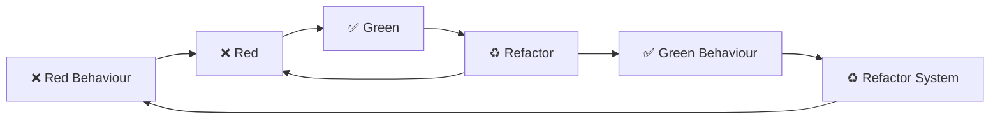

# Experiminets in Workshop

[
](https://github.com/failure-driven/experiments-in-workshops/actions/workflows/ci.yml)

Ideas on how to run a workshop, intially on testing.

## Scenario: AI powered guest book

```gherkin
Given a simple guest book app
When a new guest book entry is added
And the generate AI text option is selected
Then the user is informed that AI is processing the request
When the AI request is complete
Then a number of AI generated guest book entries are presented
When the user accepts an entry
And submits
Then the guest book entry is visible
```

### Setup

```sh
cd guestbook-rails-minimal
bin/setup
bin/rails server
open http://localhost:3000
```

```sh
make
just
just demo-ai

just clean
```
### PROGRESS

#### COURSE ON THE DAY

- what it's about
- here is the how to guide
- starting point
  - extension - idea - _nice to have_
- have a go ~10min
- code along solution - run through solution
- if not working check out ours and code along

- **LAB 1** - getting started
  - how to guide - MD
  - happy path guestbook fill in and display
  - ERROR case: deal with no name, no text - error case at model level + some
    controller
  - run through test as is
  - show how to add enough for failure branch

- **LAB 2** - add fields
  - db migrations - maybe in sql - or show sql - update to structure.sql
  - form fields
  - potentially a fork in controller logic - or should this go to a service?

- **LAB 3** - add AI
  - add job
  - add Generator with test adaptor
  - kick off in controller/service
  - test now pass

#### TODO

- [ ] selena simple slides
  - [ ] better names for the labs
  - [ ] how to guide to be displayed on screen
- [ ] basic styling CSS - just polished enoughed
- [ ] SQL over Arel
- [ ] model names
- [ ] 1 error handler in controllers - maybe
- [ ] flow of the system Form New -> wait for AI -> publish
  - [ ] flow basic Form New -> publish
  - [ ] how can we simplify the flow - just make all AI or another button or other???
  - [ ] remove choice to use AI message in screen 3 - use it as an extension
- [ ] ** base code in a commit
  - [ ] 3 intermediate commits with commented out code and commented code
  - [ ] see how we can make this work
- [ ] optional look at helpers - page fragments - MM & SS not workshop
- [ ] ** Add AI

#### DONE

- [NOT] do we need to know if it is published or not? entry.published true | false
- [x] turn off required params

### Guestbook rails minimal

[
](https://github.com/failure-driven/experiments-in-workshops/actions/workflows/guestbook-rails-minimal-ci.yml)

```sh
cd guestbook-rails-minimal
just build
```

### Plain old coding dojo

1. choose a problem
    1. from a kata site
        1. http://codekata.com/
        1. https://github.com/gamontal/awesome-katas
        1. https://codingdojo.org/kata/
    1. formulate own problem
        1. **Given** some `state`
        1. **When** some `action` is performed
        1. **Then** some `result` can be asserted
1. create a folder or repo
   ```sh
   mkdir dojo
   git init
   # OR
   git clone git@github.com:failure-driven/dojo.git

    # AND
   mkdir `date +%F`-name-of-kata
   ```
1. setup ruby, rspec and a first test
   ```sh
   cd ... # directory created above

   # setup a ruby version
   asdf local ruby 3.3.0

   # initalize bundler for gem managment
   bundle init

   # add rspec gem
   bundle add rspec

   # initialize rspec
   bundle exec rspec --init

   # run rspec
   bundle exec rspec

   # create a dummy test and run it
   cat << EOF > spec/first_spec.rb
   RSpec.describe "first test" do
     it "runs" do
       expect(true).to be_truthy
     end
   end
   EOF

   # run it
   bundle exec rspec

   # switch to documentation format and run it
   echo "--format documentation" >> .rspec
   bundle exec rspec

   # create a lib directory for your implementation
   mkdir lib
   # create a class
   cat << EOF > lib/first.rb
   class First
   end
   EOF

   # make sure to require it in your spec
   # in spec/first_spec.rb
   require 'first'
   ```

1. TDD (Test Driven Development): red -> green -> refactor

   ```mermaid
   flowchart LR
       Red["❌ Red"] --> Green["✅ Green"]
       Green --> Refactor["♻ Refactor"]
       Refactor --> Red
   ```

    1. Break the problem into first smallest chunk
    1. Write a failing test ❌ red
    1. Shamelessly implement as quickly as possible ✅ Green
    1. ♻ Refactor
        1. DRY - don't repeat yourself
        1. Both the code and the tests
        1. DAMP tests - Descriptive and Meaningful Phrases
        1. SOLID principles
            1. **S**ingle responsiblity
            1. **O**pen close
            1. **L**iskov substition
            1. **I**nterface segregation
            1. **D**ependency inversion
        1. others ...

1. Outside in BDD and TDD, BDD (Behaviour Driven Development):
   from the user perspective and TDD from the unit perspective



#### Extras

- [co authors](./docs/co_authors.md)
- [watch specs with guard](./docs/watch_specs.md)
- [runnable command](./docs/runnable_command.md)
- [end-to-end tests](./docs/end_to_end_tests.md)
- [rubocop for linting](./docs/rubocop.md)
- [Makefile](./docs/makefile.md)
- [justfile](./docs/justfile.md)
- [LOL commits](./docs/lol_commits.md)

**Use it in rails**

```sh
rails new my-new-rails-project \
    --skip-git \
    --minimal \
    --database=postgresql \
    --template rails_setup/rails_with_testing_template.rb

cd my-new-rails-project

# generate a root controller
rails generate controller Welcome index \
    --no-helper \
    --test-framework=rspec

sed -i .old '/# root/s/# root.*$/root "welcome#index"/' config/routes.rb
rm config/routes.rb.old

# switch a dojo thing into a gem
cat << EOF > my_dojo_thing.gemspec
Gem::Specification.new do |s|
  s.name        = "my_dojo_thing"
  s.version     = "0.0.1"
  s.summary     = "Substring context"
  s.authors     = ["mob code session"]
  s.files       = ["lib/my_dojo_thing.rb"]
end
EOF

# and build it
gem build my_dojo_thing.gemspec

# add it as a dependency in Gemfile
bundle add my_dojo_thing --path "../../dojo/my_dojo_thing"
# alternately if you have a date or other cruft
bundle add my_dojo_thing --path "../../dojo/YYYY-MM-DD-my_dojo_thing"

# and use it in the controller
  def index
    @input = params[:input]
    my_dojo_thing = MyDojoThing.new
    @output = my_dojo_thing.action(@input)
  end

# and view
  <%= form_with url: root_path, method: :get do |form| %>
    <div>
      <%= form.label :input %>
      <%= form.text_area :input, value: @input %>
    </div>
    <div>
      <%= form.submit :submit %>
    </div>
  <% end %>

  <% if @output %>
    <textarea>
      <%= @output %>
    </textarea>
  <% end %>
```

### Next Steps

- [ ] basic rails project to add an AI guestbook button to
    - [ ] maybe using a rails generator template?
    - [ ] myabe added as a rails engine?
- [ ] fine tune the use of an AI backend?
    - [ ] use a key for OpenAI?
    - [ ] fine tune the **ollama** grammer?
        - https://github.com/crimson-knight/llamero
        - also take a look at a grammer PR
          https://github.com/ollama/ollama/pull/1606
    - [ ] take a look at the **falcon** example
        - https://github.com/socketry/falcon-rails-example/commit/965c72052c88c3b213f58c0f0056a1a30201cb0b

## Random thoughs

- [ ] how to deal with environment setup
    - [ ] github code spaces?
- [ ] how to deal with transitioning in code updates, student created vs
  requried for the next section
    - [ ] branches
    - [ ] patches
    - [ ] separate directory? packwerk package for rails?
- [ ] basic "Outside in BDD" workshop
    - the hypothesis is
    > "lot's of new people to the industry know how to code, but they don't
    > know how to get started to build out a complete product"
    - [ ] demonstrate how BDD flow can benefit an existing application - "add
      AI messages to guest book"
    - [ ] use AI chat to generate a general set of acceptance criteria for the
      product: blog, marketplace, social platform, etc
    - [ ] basic setup for BDD/TDD web in your platform of choice: Rails,
      Node(Next? other?), Angular + API, etc
    - [ ] drive out the first flow and associated TDD unit specs
    - [ ] cover off CRUD, background jobs, external services and hexagonal
      architecture
    - [ ] touch on microservices and contract testing
    - [ ] other kinds of testing - property based, random
    - [ ] tracking business level success throught statsd/OpenTelemetry?
- [ ] to use ASDF in github codespaces, and potentially other custom things, try
    - https://github.com/iloveitaly/asdf-devcontainer
    - https://mikebian.co/my-experience-with-github-codespaces/
- run existing `guestbook-rails-minimal` in github codespaces
  ```sh
  # no asdf see above ^^
  rvm install "ruby-3.2.2"
  bundle
  bin/rspec # fails no browser
  sudo apt-get update && sudo apt-get install firefox
  # but we have chrome setup
  # following https://askubuntu.com/questions/510056/how-to-install-google-chrome

  # fails
  sudo apt-get update && sudo apt-get install google-chrome-stable

  wget https://dl-ssl.google.com/linux/linux_signing_key.pub -O /tmp/google.pub
  gpg --no-default-keyring --keyring /etc/apt/keyrings/google-chrome.gpg --import /tmp/google.pub
  echo 'deb [arch=amd64 signed-by=/etc/apt/keyrings/google-chrome.gpg] http://dl.google.com/linux/chrome/deb/ stable main' | sudo tee /etc/apt/sources.list.d/google-chrome.list
  sudo apt-get update
  # should work here? maybe
  sudo apt-get install google-chrome-stable

  # I did this as well
  wget -q -O - https://dl-ssl.google.com/linux/linux_signing_key.pub | sudo apt-key add -
  echo 'deb [arch=amd64] http://dl.google.com/linux/chrome/deb/ stable main' | sudo tee /etc/apt/sources.list.d/google-chrome.list
  sudo apt-get update
  sudo apt-get install google-chrome-stable

  # still crashses
  bin/rspec

  # but bin/rails server runs
  bin/rails s
  # prompt to make public or open via new window

  # fixed by using --headless
  cat spec/support/capybara.rb
  ...
  if ENV.fetch("CODESPACES", nil) == "true"
    options.add_argument("--headless")

  # errors are saved as screen shots and can be viewed through VS Code
  code tmp/capybara/screenshot*.png
  ```

- [ ] other options for browser testing
    - [x] using TestCafe - running headless - claims you can ONLY run headless
      [](https://youtu.be/117-9BoVoH0)
    - [ ] [How to Run Playwright Tests in GitHub Codespaces - Nikolay
      Advolodkin (Aug 17, 2023)
      ](https://nikolay-dev.medium.com/how-to-run-playwright-tests-in-github-codespaces-5ac5dcd1babd)
    - [ ] [How do you use Codespaces with tools like Playwright/Cypress? #47700
      ](https://github.com/orgs/community/discussions/47700)
    - [x] feature request [Allow running cypress in codespaces #27217
      ](https://github.com/cypress-io/cypress/issues/27217)
    - [ ] https://github.com/AriPerkkio/cypress-codespaces-example
    - [ ] **HIGH HOPE**
      https://devopstar.com/2022/01/03/cypress-testing-in-devcontainers-and-github-codespaces/
    - [ ] **HIGH HOPE** with support for codespaces
      https://github.com/webdriverio/webdriverio
    - [ ] general info about development in codesapces
      https://docs.github.com/en/codespaces/developing-in-a-codespace/developing-in-a-codespace

## Progress NextJS

- **Database**
    - NextJS tutorial uses vercel and that only supports Postgres and does not
      seem to have migrations
        - https://nextjs.org/learn/dashboard-app/fetching-data
        - https://vercel.com/docs/storage/vercel-postgres/sdk#sql
        - they recommend to create a seeds endpoint to create the tables
          https://github.com/vercel/next-learn/blob/main/dashboard/starter-example/app/seed/route.ts
    - sounds like Prisma supports fetching and DB migrations
        - https://medium.com/@bryantbrock/data-migrations-with-prisma-94909cb0c0c0
        - https://www.prisma.io/docs/getting-started/quickstart-sqlite
        - there are also
            - https://github.com/prisma/prisma-examples/tree/latest
            - and the core ORM https://github.com/prisma/prisma
    - attempted
        ```sh
        npm install --save-dev prisma
        npx prisma
        npx prisma init
        npx prisma init --datasource-provider sqlite
        vi prisma/schema.prisma
        npx prisma migrate dev --name init
        ```
        - but got stuck not being able to call it from a React component.
    - [x] next time continue with the above and some server side scripts. later
      transition to having the scripts run in NextJS server components?
    - we have FROM -> DB -> display
    - [ ] next time get BullMQ job to perform in background
    - [ ] add bootstrap for styling
    - [ ] E2E test for FORM -> DB -> display
    - [ ] Component tests?
    - [ ] Unit tests?
    - [ ] add the AI adaptor
    - [ ] auto run, start server and run tests
    - [ ] seed the db
    - [ ] reset the db in test and run against a test version of DB
    - [ ] is primsa ORM ok? or should we go for something more SQL

